## Design Patterns

[SourceMaking: Design Patterns](https://sourcemaking.com/design_patterns)

**What are design patterns?**

Design patterns are general reusable solutions to common problems that occur during software development. They represent best practices for designing and structuring code to solve certain types of problems.

## Low Level Design Problem Statements

### 1. Design an ATM

#### Details:
- **Problem**: Handling different types of transactions (withdrawal, deposit, balance inquiry).
- **Pattern**: Chain of Responsibility.
- **Description**: Each handler in the chain processes a specific type of transaction.

#### UML Diagram:

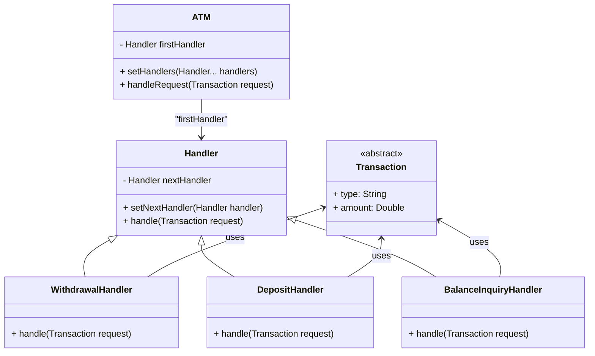

## 2. Design an Elevator System

#### Details:

- **Problem:** Managing elevator states and notifying floors.
- **Pattern:** State, Singleton, Observer.
- **Description:** Elevator state management, single instance control, and floor notifications.

#### UML Diagram:

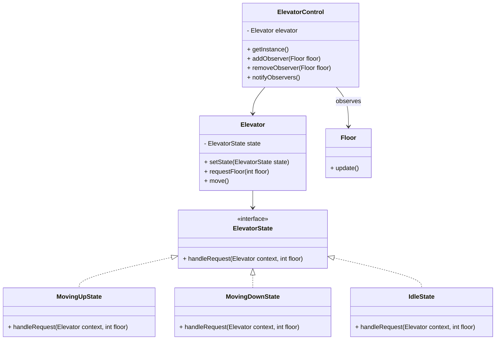

## 3. Design a Vending Machine

#### Details:

- **Problem:** Managing different states of the vending machine.
- **Pattern:** State.
- **Description:** Handling different states like waiting for money, dispensing item, and returning change.

#### UML Diagram:

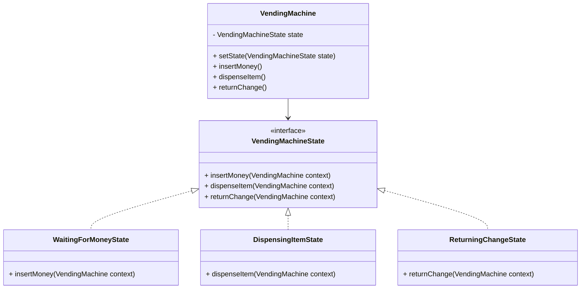

## 4. Design a Parking Lot System

#### Details:

- **Problem:** Managing parking spaces with different strategies.
- **Pattern:** Strategy, Singleton, Factory Method.
- **Description:** Implementing different parking strategies and ensuring a single instance of the parking manager.

#### UML Diagram:

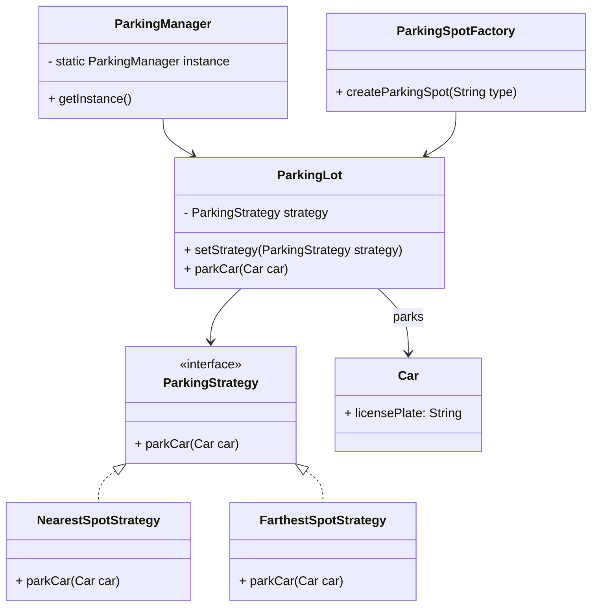

## 5. Design a Library Management System

#### Details:

- **Problem:** Managing different media types and notifications.
- **Pattern:** Factory Method, Observer, Strategy.
- **Description:** Creating different media items and notifying users about availability.

#### UML Diagram:

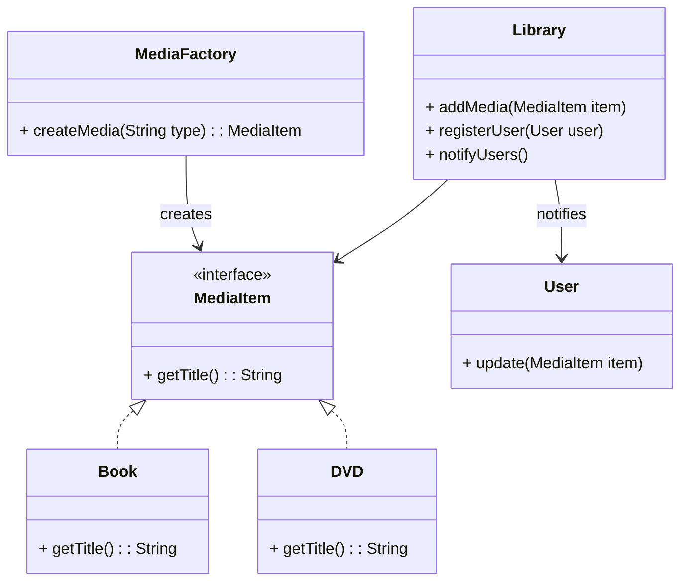

## 6. Design a Restaurant Reservation System

#### Details:

- **Problem:** Managing reservations with different strategies.
- **Pattern:** Singleton, Strategy.
- **Description:** Implementing various reservation algorithms and ensuring a single instance of the reservation manager.

#### UML Diagram:

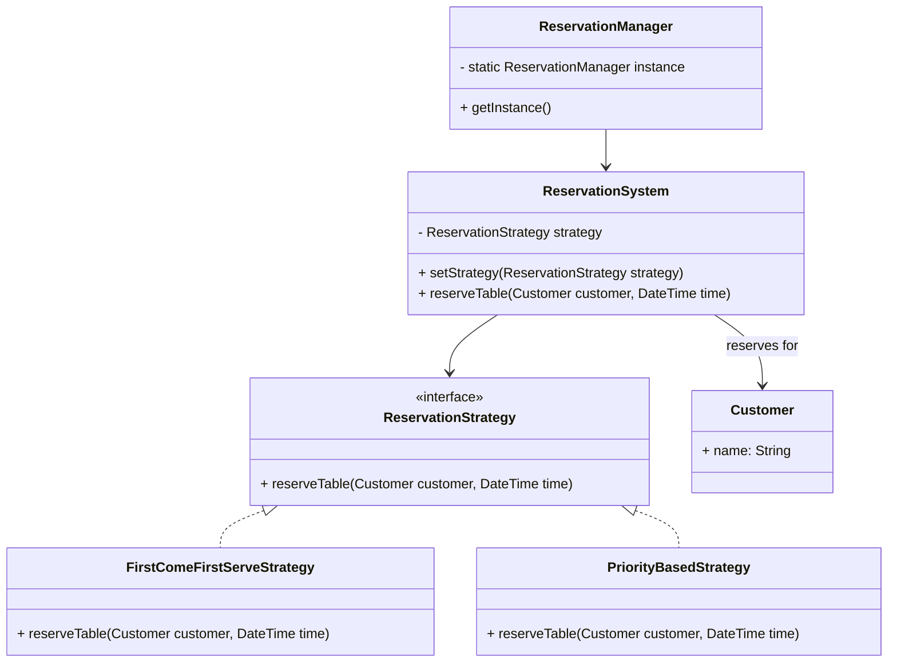

## 7. Design a File System

#### Details:

- **Problem:** Managing files and directories in a hierarchical structure.
- **Pattern:** Composite, Iterator.
- **Description:** Treating files and directories uniformly and iterating over files in a directory.

#### UML Diagram:

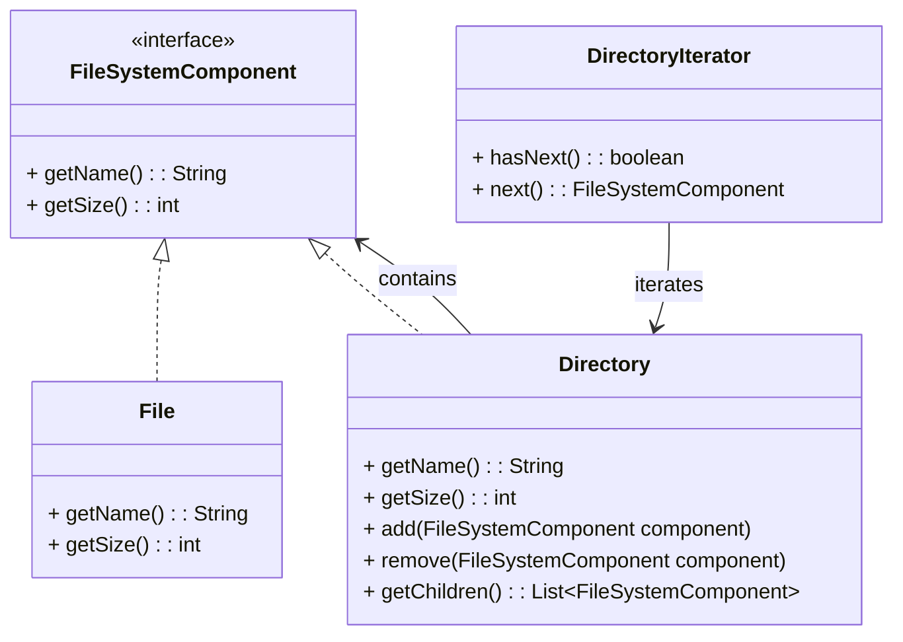

## 8. Design a Notification System

#### Details:

- **Problem:** Notifying multiple subscribers of an event.
- **Pattern:** Observer, Factory Method.
- **Description:** Creating different types of notifications and notifying subscribers.

#### UML Diagram:

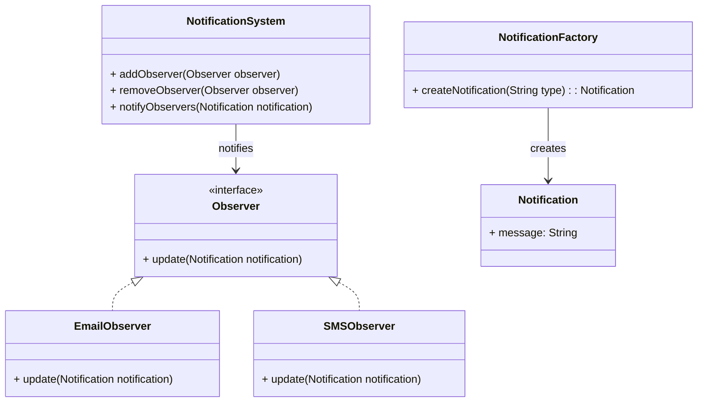

## 9. Design a Chat Application

#### Details:

- **Problem:** Managing communication between multiple chat participants.
- **Pattern:** Mediator, Observer.
- **Description:** Using a mediator to handle communication and observers to update participants of new messages.

#### UML Diagram:

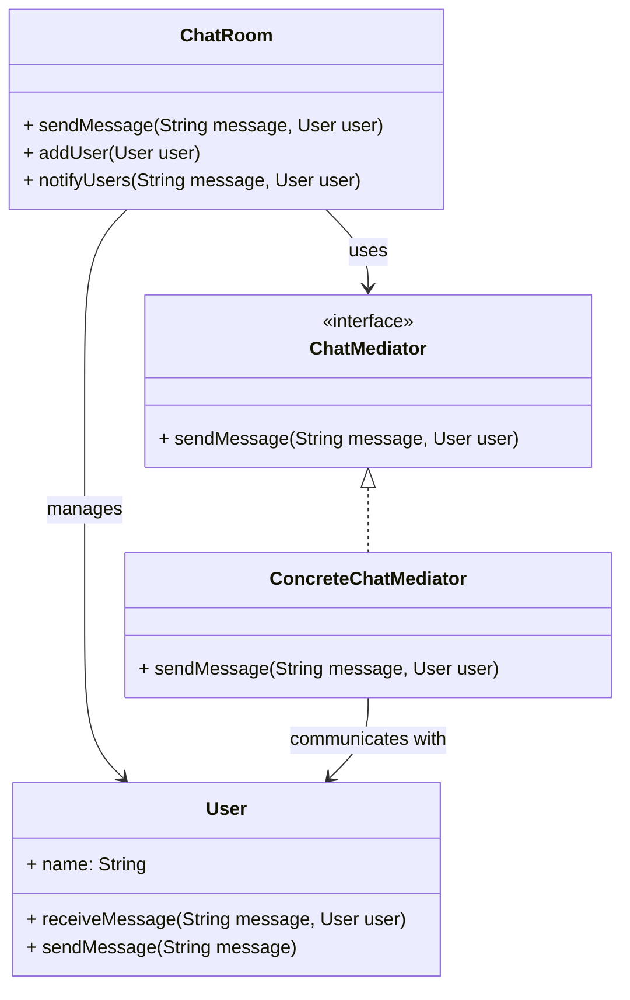
## 10. Design an Online Shopping Cart

#### Details:

- **Problem:** Handling different discount strategies and implementing undo functionality.
- **Pattern:** Strategy, Command.
- **Description:** Using different discount strategies and implementing actions like adding/removing items.

#### UML Diagram:

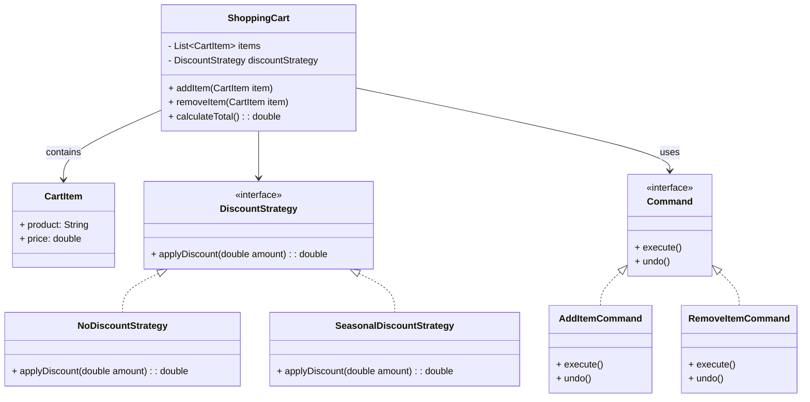

## 11. Design a Traffic Light System

#### Details:

- **Problem:** Managing the different states of traffic lights.
- **Pattern:** State.
- **Description:** Handling different states like red, green, and yellow.

#### UML Diagram:

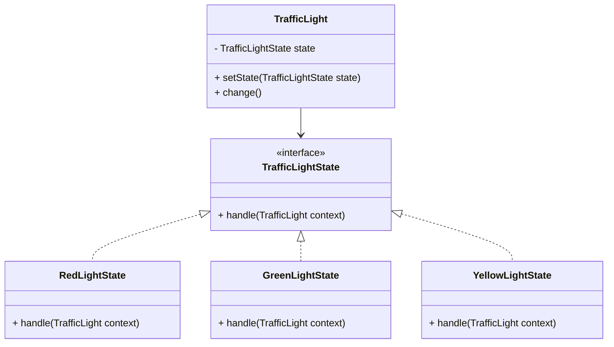

## 12. Design a Movie Ticket Booking System

#### Details:

- **Problem:** Managing bookings and different seating strategies.
- **Pattern:** Singleton, Strategy, Template Method.
- **Description:** Ensuring a single instance of the booking manager, using different seating strategies, and defining the steps to book a ticket.

#### UML Diagram:

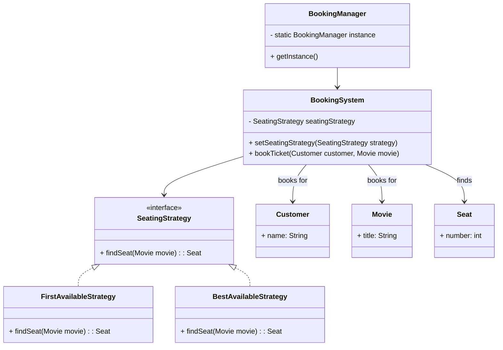

## 13. Design an Online Payment System

#### Details:

- **Problem:** Handling different payment methods and steps in the payment process.
- **Pattern:** Strategy, Factory Method, Chain of Responsibility.
- **Description:** Using different payment methods, creating different payment gateways, and handling payment steps.

#### UML Diagram:

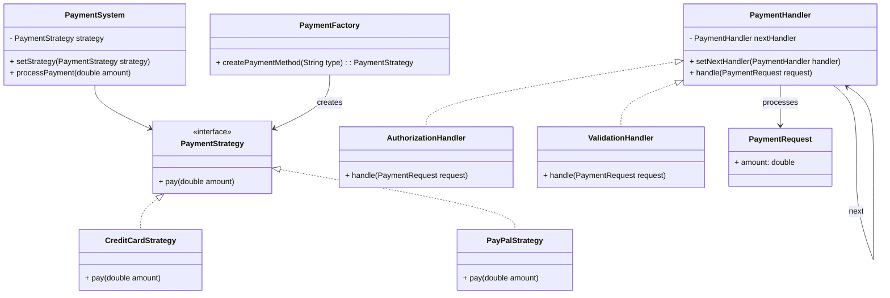

## 14. Design a Social Media Platform

#### Details:

- **Problem:** Managing posts and updating followers.
- **Pattern:** Observer, Factory Method, Command.
- **Description:** Updating followers of new posts, creating different types of posts, and implementing actions like liking, sharing, and commenting.

#### UML Diagram:

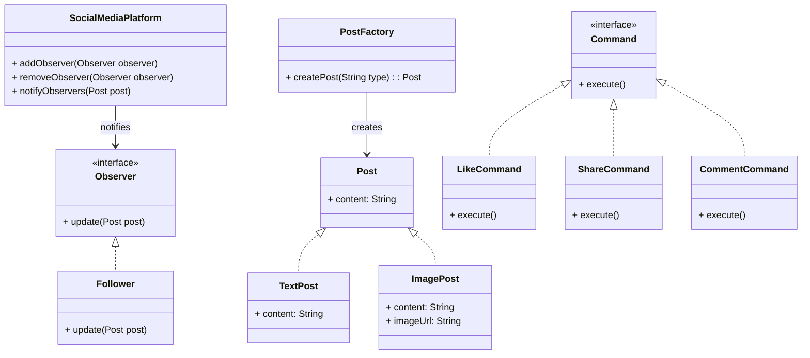

## 15. Design a Hospital Management System

#### Details:

- **Problem:** Managing patients' states and notifying doctors and patients.
- **Pattern:** Observer, Factory Method, State.
- **Description:** Notifying doctors and patients of updates, creating different types of medical records, and managing patient states.

#### UML Diagram:

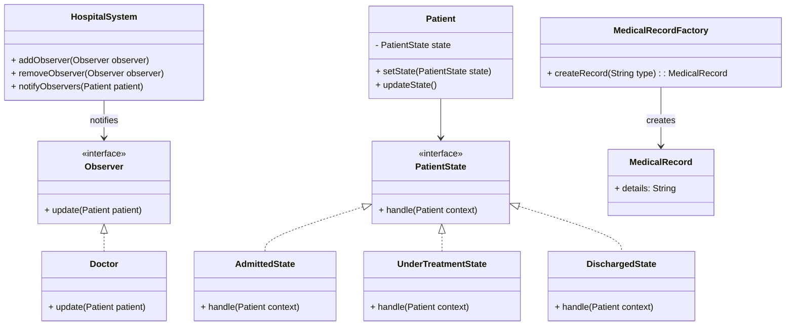

